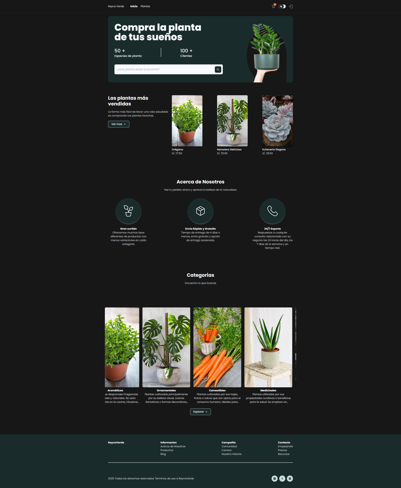
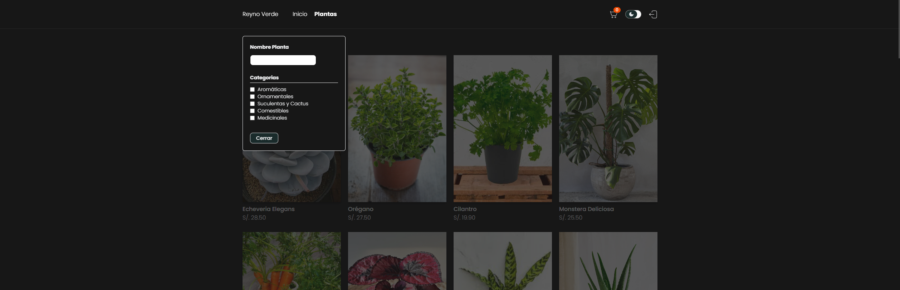
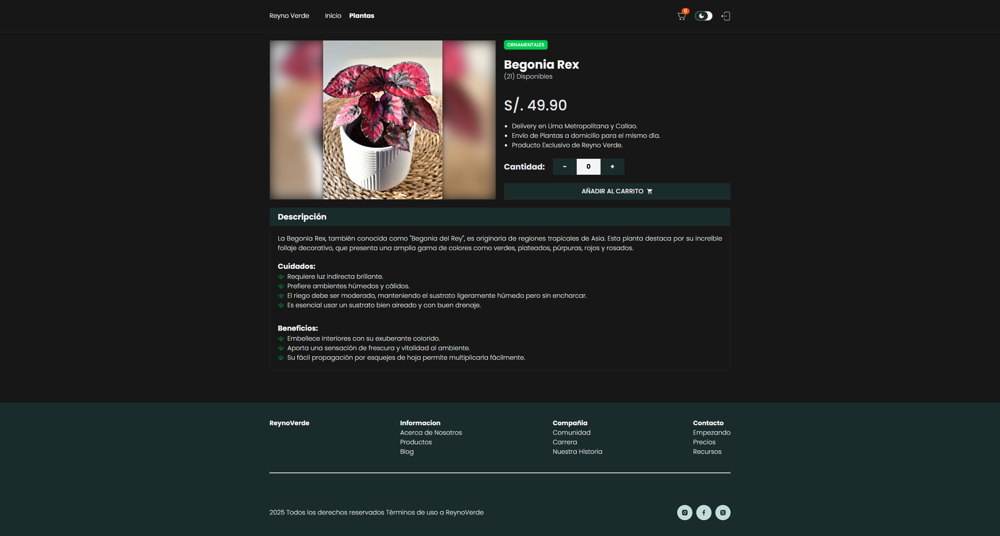
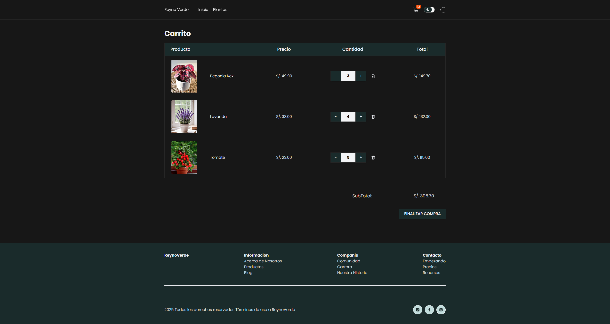

# Reyno Verde — Frontend (Angular 19)

Plataforma web para buscar y comprar plantas. Frontend en **Angular 19 + Tailwind v4**, que consume una **API .NET** (autenticación por **cookies**).

---

## 📦 Stack

- **Angular 19** (standalone components, signals, `NgOptimizedImage`)
- **Angular Router** (lazy loading)
- **Tailwind CSS v4**
- **API .NET** (login/registro, catálogo, categorías)

---

## ✨ Características

- **Login/Registro** y guard de rutas privadas (`privateGuard`)
- Listado de **plantas** con filtros por **categoría** y **nombre**
- **Detalle** de producto (beneficios, cuidados, precio)
- **Carrito** persistido en `localStorage`, subtotal dinámico
- **Loader global** controlado por `LoadingService`
- Directivas de efectos: `EfectoScrollDirective`, `EfectoDeslizamientoDirective`
- Tema **claro/oscuro** con `signal` (`TemaComponent`)

---

## ✅ Requisitos

- **Node.js 18+**
- **Angular CLI 19+**
- API .NET disponible: https://github.com/BlackDoubleB/ReynoVerde-Api.git
  
---

## 🚀 Inicio Rápido

```bash
# 1) Clonar
git clone <url-del-repo>
cd reyno-ver-angular

# 2) Instalar dependencias
npm install

# 3) Desarrollo (sirve en http://localhost:4200)
npm start
# o
ng serve --open
```

## 🧩 Estructura Principal

```
src/
├─ app/
│ ├─ components/ (UI reutilizable)
│ │ ├─ barra-filtro/ (Filtro por nombre/categorías (emite selección))
│ │ ├─ botones/boton-redirigir/ (estilizado para navegación)
│ │ ├─ card-1/ card-2/ (Cards de producto/categoría (NgOptimizedImage))
│ │ ├─ carga/ (Pantalla "loading" a pantalla completa)
│ │ ├─ comentarios/ (Bloque de comentario/autor/fecha)
│ │ ├─ portada/ (Hero de la página de inicio)
│ │ └─ tema/ (Toggle claro/oscuro)
│ │
│ ├─ features/ 
│ │ ├─ auth/ (Login/Registro y servicios de cuenta)
│ │ │ ├─ login/ 
│ │ │ ├─ auth.service.ts
│ │ │ └─ account.interface.ts 
│ │ ├─ core/ (Guards)
│ │ │ └─ auth.guard.ts (privateGuard: fuerza sesión antes de entrar al layout)
│ │ ├─ dashboard/ (Área logueada: inicio, carrito, plantas, detalle)
│ │ │ ├─ layout/ 
│ │ │ ├─ inicio/
│ │ │ ├─ carrito/ 
│ │ │ ├─ directivas/ 
│ │ │ └─ planta/ 
│ │ │ ├─ planta-seccion/ 
│ │ │ ├─ planta-detalle/ 
│ │ │ └─ categoria/ 
│ │ └─ services/ (Servicios compartidos: estado/autenticación)
│ │   └─ auth/ 
│ │   └─ state/
│ │ 
│ ├─ app.component.html 
│ ├─ app.routes.ts 
│ ├─ app.config.ts 
│ ├─ app.component.ts  
│ └─ interfaces.ts 
│
├─ environments/
│ ├─ environment.ts (Producción: API pública)
│ └─ environment.development.ts (Desarrollo: API local)
│
├─ styles.css (Tailwind v4, fuentes Poppins, animaciones)
├─ index.html
└─ main.ts
```
---
## 🧭 Rutas

Las rutas bajo el **Layout** (`/`) están **protegidas** por `privateGuard` (requieren sesión vía cookie).

| Ruta | Privada | Descripción |
|---|:---:|---|
| `/inicio` | ✅ | Home: portada, más vendidas, categorías. |
| `/plantas` | ✅ | Listado de plantas con **filtros** (por nombre y categorías). |
| `/plantas/planta/:id/:slug` | ✅ | **Detalle** de producto (precio, stock, cuidados, beneficios). |
| `/plantas/categorias` | ✅ | Vista de categorías. |
| `/carrito` | ✅ | Carrito con cantidades, subtotal, eliminar ítems. |
| `/auth/login` | ❌ | Login (setea cookie; requiere `withCredentials`). |
| `/auth/registro` | ❌ | Registro de usuario. |

---

## 🧰 Componentes destacados

- **Filtro** (`BarraFiltroComponent`): nombre + categorías, emite selección y sincroniza con query params
- **Cards** (`Card1Component`, `Card2Component`): producto/categoría con `NgOptimizedImage`
- **Tema** (`TemaComponent`): toggle oscuro/claro (agrega `.dark` al `<html>`)
- **Carga** (`CargaComponent`): pantalla de loading a pantalla completa

---


## 📸 Capturas de pantalla

1. **Login**  
   

2. **Registro**  
   

3. **Inicio**  
   

4. **Listado de Plantas**  
   

5. **Filtro**  
   

6. **Detalle de Planta**  
   

7. **Carrito**  
   


## 👩‍💻 Autora

Reyna Blacido (BlackDoubleB)  
Desarrolladora web en formación apasionada por la tecnología y el diseño.
